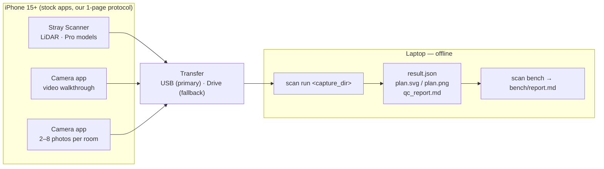
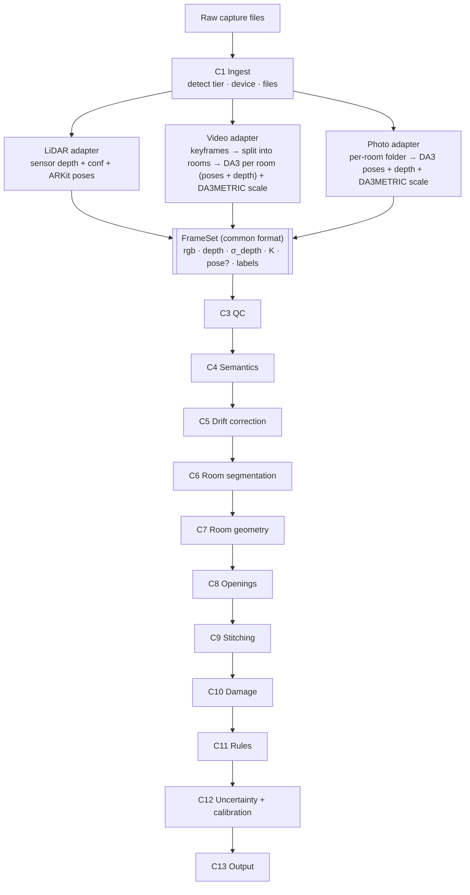
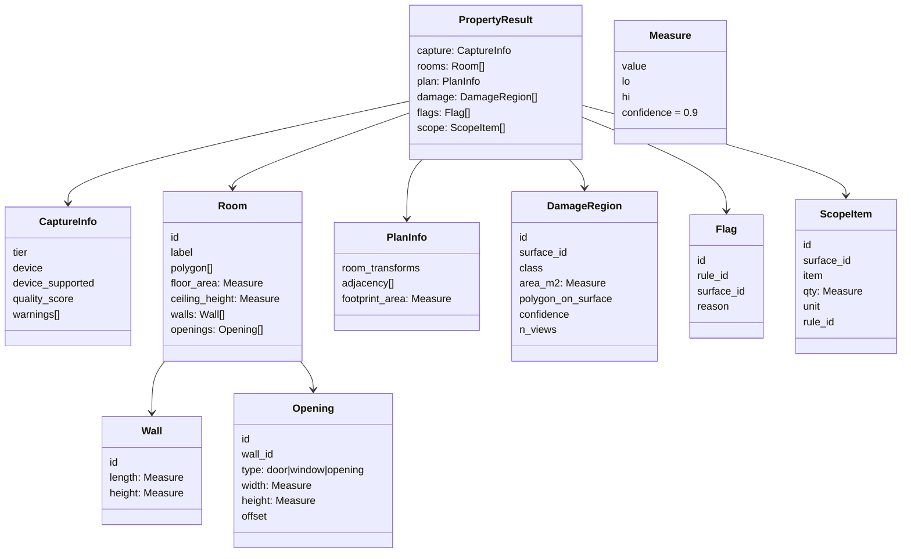
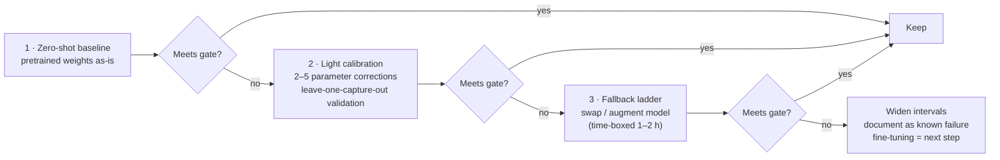
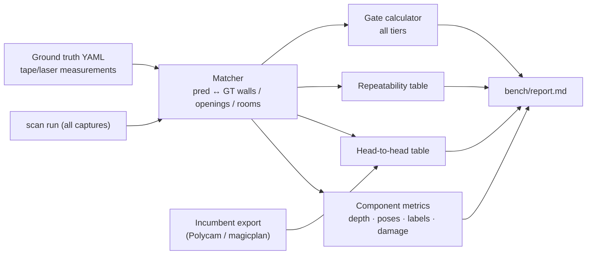

# Property Scan AI — High-Level Design (v2, as built)

| | |
|---|---|
| **Status** | As built — v1 plan (2026-10-03) updated with what changed and why (section 0) |
| **Date** | 2026-10-04 |
| **Scope** | Round-2 Applied AI case study — handheld iPhone capture → stitched, dimensioned floor plan with damage, scope and calibrated intervals |

---

## 0. As built: what changed from the v1 plan, and why

Every change below was forced by a measurement on the benchmark flat (details in `docs/LLD/13_video_photo_tiers.md`, `docs/fix_loop.md`).

| Area | v1 plan | As built | Why (measured) |
|---|---|---|---|
| Photo / video poses | pycolmap SfM | **Depth Anything 3 (DA3-BASE)**: poses + depth for a set of images jointly | COLMAP registered 0/8 photos per room (taken turning on the spot) and split the video into 18 pieces |
| Metric scale | Depth Anything V2 Metric-Indoor | **DA3METRIC-LARGE** (focal-aware: m = focal × output / 300) | DA V2 is focal-blind: ceiling 3.67 m vs 2.93 m (+25 %) |
| Video pipeline | One trajectory, fused | **Room mode**: split the walk into rooms by shared views, reconstruct each like a photo folder | Chunk chains drift 13–33 % in scale; fused rooms smeared (fix loop, 4 attempts) |
| Photo stitching | Door matching + no-overlap solver | Door matching (C8 doors + door-labelled voxel clusters); **unconnected rooms reported, never guessed** | Benchmark photos never show a doorway from both sides |
| Drift (LiDAR) | Loop closures + pose graph | Loop closures, else **plane-anchored heading**; measured on every capture, applied above 1° | 3BHK walk has no revisits; correcting 0.85° moved outlines more than it fixed lengths |
| Damage | OWLv2 + SAM 2-tiny | **OWL-ViT B/32** + classical mask refinement | OWLv2 / SAM 2 too slow on CPU; SAM 2 needs extra deps |
| Calibration | Per-tier factors | Per tier and quantity, k ≥ 1 (never narrower), leave-one-out coverage reported | n = 4–7 rows per factor |
| Fusion | One setting | Estimated-depth tiers fuse every pixel, 2 hits per voxel | LiDAR setting kept 9 voxels from 8 photos |
| Capture protocol | 2–8 photos, any lens | **1× lens, landscape, from the corners across the room**; video through room centres | 0.5× lens: up to 11 % small; portrait: scale unstable; close-ups: no floor |

## 1. Problem in one paragraph

A person walks through a property with an iPhone. From that capture we must produce, with **one command**, a JSON document (to a schema we publish) and a rendered **whole-property floor plan**: every room's walls, ceiling height, floor area and openings; how rooms connect; damage regions per surface with class and area; concealed-damage flags with the rule that fired; scope line items; and a **calibrated confidence interval on every number**. This must work from three input tiers — **photos, video, LiDAR** — with intervals that widen honestly as the input gets thinner, run offline on a CPU laptop, and be scored live on a space we have never seen.

## 2. Goals and non-goals

**Goals**

- One command per capture → `result.json` + `plan.svg/png` + `qc_report.md`, identical contract for all three tiers.
- Calibrated 90% intervals on every measurement, at every tier.
- Stitched whole-property plan from every tier, including per-room photo folders.
- Drift correction with an on/off ablation.
- A benchmark harness that regenerates every reported number from raw inputs.
- Fully offline at run time; clean-machine setup in under 15 minutes.

**Non-goals (v1)**

- Our own iOS app (no Mac → stock capture apps + a one-page protocol).
- Any frontend/web UI — CLI only.
- LLMs or any cloud API (kept as a possible later stretch, never in the scored path).
- GPU-only models; training models from scratch.

## 3. Key decisions

| # | Decision | Why |
|---|---|---|
| D1 | **Capture Route 2**: Stray Scanner (LiDAR) + native Camera (photo/video) + one-page protocol | No Mac for an iOS build; the provided sample data is Stray Scanner format |
| D2 | **Tier auto-detected from files**, never asked | Removes a user-error source; data wins over claims |
| D3 | **Device check warns and widens intervals**, never blocks | Brief requires honest intervals, not refusals; device read from EXIF/QuickTime metadata |
| D4 | **No property-type input**; photo folders named per room | System must infer rooms; folder names give free labels |
| D5 | **Normalise early** — every tier becomes a common `FrameSet` | One shared geometry engine; uncertainty flows through automatically |
| D6 | **Geometry has the final say**; model outputs are votes | Limits the damage any model error can do |
| D7 | **Fully offline, no LLM in v1** | "Without calling your infrastructure" + live walk-in risk; LLMs don't move the laser-measured score |
| D8 | **Pretrained first → light calibration → fine-tune only if needed** | Avoids overfitting to a few captures; walk-in is an unseen space |
| D9 | **CPU-only model choices** | Dev/demo laptop: i5-1135G7, 8 GB RAM, no NVIDIA GPU |

## 4. System context



## 5. Architecture

### 5.1 Core idea — normalise early, share everything downstream



Uncertainty per tier (σ small for LiDAR, medium for video, large for photos) is carried inside the `FrameSet`, so the "intervals widen honestly" requirement is a property of the design rather than three special cases.

### 5.2 Components

| # | Component | Input → Output | Method / model |
|---|---|---|---|
| C1 | **Ingest** | capture dir → `CaptureMeta` | Tier from file layout; device model from metadata; device-matrix lookup |
| C2 | **Tier adapters** | raw → `FrameSet` | LiDAR: parse Stray export. Video: keyframes → rooms by shared views → DA3 per room. Photo: DA3 per room folder. Scale: DA3METRIC. (v1: pycolmap + DA V2 — replaced, section 0) |
| C3 | **QC** | `FrameSet` → filtered `FrameSet` + `QualityReport` | Blur, brightness, motion speed, depth confidence, coverage (e.g. ceiling never seen) |
| C4 | **Semantics** | frames → per-pixel labels | SegFormer (ADE20K): wall, floor, ceiling, door, window, mirror, furniture |
| C5 | **Drift correction** | poses → corrected poses | Fragments → ICP loop closures → Open3D pose graph + plane/Manhattan anchoring; `--no-drift-fix` for ablation |
| C6 | **Room segmentation** | fused cloud → rooms | Top-down free-space map → doorway pinch points → rooms. Photo tier: rooms = folders |
| C7 | **Room geometry** | room points → `Room` | RANSAC planes on wall-labelled points (optionally TSDF-fused), Manhattan snap, polygon from wall intersections, floor/ceiling plane distance, floor area |
| C8 | **Openings** | wall planes + labels → `Opening[]` | Per-wall 1 cm plane image (on-plane vs through-plane points), SegFormer door/window votes, **high-res RGB edge refinement** across views |
| C9 | **Stitching** | rooms → `PropertyPlan` | LiDAR: shared world frame, adjacency via shared openings. Photo / video rooms: placed by matching a door seen from both sides; otherwise reported unconnected |
| C10 | **Damage** | frames + surfaces → `DamageRegion[]` | OWL-ViT B/32 (text prompts + decoys) → classical mask refinement → projection onto surface plane → m² → multi-view fusion |
| C11 | **Rules** | damage + surfaces → flags + scope | YAML rules engine; every flag/line item records the rule id |
| C12 | **Uncertainty + calibration** | raw σ → 90% intervals | σ from fit residuals, depth noise, QC score; per-tier factors fitted on the benchmark; LiDAR depth-scale bias correction against tape |
| C13 | **Output** | everything → files | pydantic models → `result.json` + generated `schema.json`; SVG plan; template text summary; QC report |
| C14 | **Benchmark harness** | outputs + ground truth → reports | Gate tables (all tiers), repeatability, head-to-head, timing, **component-level model metrics** |

## 6. Tier design and device matrix

| Step | LiDAR | Video | Photos |
|---|---|---|---|
| Depth | Sensor | DA3-BASE per room segment | DA3-BASE per room folder |
| Poses | ARKit (Stray) + drift check / correction | DA3 per room segment (no global frame) | DA3 per room (no global frame) |
| Scale | Metric (sensor) | DA3METRIC on 4 frames per room | DA3METRIC on 4 photos per room |
| Stitching | Shared world frame | Door matching between room segments | Door matching between room folders |
| Interval width (calibrated) | ~±2–9 cm | wide, uncalibrated (gate fails) | ~±0.3 m |

| Device | Photos | Video | LiDAR |
|---|---|---|---|
| iPhone 15 / 15 Plus / 16 / 16 Plus / 17 / Air (non-Pro) | ✅ | ✅ | ❌ no sensor |
| iPhone 15 Pro / Pro Max, 16 Pro / Pro Max, 17 Pro / Pro Max | ✅ | ✅ | ✅ |
| Older than iPhone 15 | Runs with warning + widened intervals | Same | If LiDAR present: same |

## 7. Data model



Every numeric field is a `Measure` (value + 90% interval). A measurement that cannot be made (e.g. ceiling never seen) is `null` with a reason in `warnings` — never a guess.

## 8. Model stack

| Purpose | Model / library | Size · CPU speed | Licence |
|---|---|---|---|
| Poses + depth (photo, video) | **Depth Anything 3 BASE** (pinned commit) | 0.12B · ~25 s/img on CPU | Apache-2.0 |
| Metric scale (photo, video) | **DA3METRIC-LARGE** | 0.35B · ~25–60 s/img | Apache-2.0 |
| Fallback metric depth | Depth Anything V2 Metric-Indoor Small (only without DA3) | ~25M · ~1 s/img | Apache-2.0 |
| Surface labels | SegFormer B0/B2 (ADE20K) | 4–25M · 0.3–1 s/img | NVIDIA Source Code Licence — **non-commercial**; disclosed. Commercial alternative: Mask2Former Swin-T (MIT, slower) |
| Fallback video poses | pycolmap (only without DA3) | — | BSD |
| Damage proposals | OWL-ViT B/32 (via transformers) | ~150M · ~1 s/img | Apache-2.0 |
| Damage masks | classical refinement (Lab anomaly + edges) | — | — |
| Geometry | Open3D (RANSAC, TSDF, ICP, pose graph), numpy, scipy, shapely | — | MIT / BSD |
| Imaging / QC | opencv-python, pillow | — | Apache / HPND |
| Contract | pydantic → JSON Schema | — | MIT |
| Rendering | svgwrite, matplotlib | — | MIT / PSF |

Weights are fetched by `scripts/fetch_weights.py`, never committed. All models and licences are disclosed in the README.

## 9. Robustness and outlier handling

Principle: **every problem either lowers confidence (wider interval) or produces a clear refusal — never a confident wrong number.**

| User behaviour / scene | Detected by | Response |
|---|---|---|
| Moving too fast, blur | Blur score, pose/flow speed | Drop frames; widen if too few remain |
| Ceiling never captured | No horizontal plane above camera | `ceiling_height = null` + warning |
| Too few / non-overlapping photos | Count, feature overlap | Reject room (< 2 photos) or widen |
| Incomplete room coverage | Gaps in wall outline | Mark walls "inferred", widen |
| Mirrors, glass | Low LiDAR confidence; `mirror`/`windowpane` labels; geometry beyond a closed wall | Mask depth, reject phantom geometry |
| Low light | Brightness/noise stats, confidence drop | Fewer frames, widen, warn |
| People moving through | Cross-frame inconsistency | Keep only multi-view-consistent geometry |
| Drift on long walks | Same wall seen twice in different places | C5 pose-graph correction |

## 10. Accuracy strategy per gate

| Gate | Where it is won | Expectation (v1) | Measured (benchmark) |
|---|---|---|---|
| Ceiling ≤ 1.5 cm | Plane fits over thousands of points; LiDAR depth-bias correction; protocol makes users tilt up | Borderline → likely pass | LiDAR 3/4 (hall −1.8 cm) |
| Ceiling spread ≤ 1 cm | Determinism, inlier-only fits | Likely pass | not measured at LiDAR (no repeat scan); photo repeat fails |
| Repeatability ≤ 1 cm / 0.5% | Fixed seeds/sampling, robust fits, Manhattan snap | Likely pass (LiDAR) | fails: photo scale varies 8–15 %; LiDAR outlines unstable under cm pose changes |
| Drift accountability | C5 + on/off ablation | Pass by construction | met: drift measured, ablation on the 3BHK |
| Openings ≤ 2 cm on ≥ 85% | TSDF + plane images + **RGB edge refinement** (≈1–2 mm/pixel at 2 m) | Hardest — likely first fix-loop target | not scored (no opening ground truth) |
| Video walls ±3% | COLMAP shape + scale averaged over many frames | Borderline | fails: 0/10 matched (fix-loop target) |
| Photo walls / footprint ±8%, stitch | Multi-cue scale, door matching, no-overlap solver | Borderline | walls 7/7 pass; stitch fails (rooms unconnected) |
| Calibration (all tiers) | C12 per-tier σ factors | In our control | LiDAR / photo calibrated (leave-one-out 75–100 %); video not calibratable |
| Head-to-head ≥ 70% beat/tie | Same sensor as incumbent + more fusion + edge refinement | Borderline (ties count) | pass: 11/12 = 92 % vs Polycam |

## 11. Model risk management

> **Outcome (as built):** this escalation plan played out. pycolmap failed on the benchmark (section 0) and
> was replaced by DA3; the video path ended where its last fallback pointed — *degrade video to the photo
> tier* — as room mode. OWLv2 + SAM 2 were replaced by OWL-ViT B/32 + classical refinement for CPU speed.
> The table below is the original plan, kept as written.

### 11.1 Measure every model separately

LiDAR captures record RGB, true depth and true poses together — free ground truth for the photo/video models.

| Model | Metric | Reference |
|---|---|---|
| Depth Anything | AbsRel, scale bias | LiDAR depth, same frames |
| pycolmap | Trajectory error | ARKit poses, same capture |
| SegFormer | Label accuracy | Plane geometry + ~10 hand-checked frames |
| OWLv2 + SAM 2 | Precision, recall, area error | Staged-damage room, tape-measured |

### 11.2 Improvement order



### 11.3 Fallback ladders

| Model | Fallbacks, cheapest first |
|---|---|
| Depth Anything V2-S | Test-time augmentation → correction curve fitted on paired LiDAR/RGB → stronger scale priors → Depth Pro / MoGe-2 / UniDepth → widen + document |
| SegFormer | Plane-geometry rules → 3D multi-view label voting → larger variant → Mask2Former |
| pycolmap | Tune matcher/keyframes → SuperPoint + LightGlue → RGB-D odometry → **degrade video to photo tier** |
| OWLv2 + SAM 2 | Prompt/threshold tuning on staged room → multi-view consistency → classical wall-anomaly proposals → Florence-2 → fewer classes, reliably |

Every model sits behind a small interface (e.g. `DepthEstimator.predict(image) → depth, σ`), so swapping is a config change and the harness re-scores it in one command.

## 12. Benchmark harness and fix loop



**Fix loop:** pick the single worst gate from `bench/report.md` → root-cause hypothesis with evidence → predict the post-fix number → ship → rerun. Before and after runs are both regenerable from a tagged commit with one command each.

**Benchmark set (our own captures):** one 3+ room capture with a connector, one furnished room with staged damage (water stain + crack), the same rooms at all three tiers (photo tier as per-room folders), one room captured twice at the same tier, tape/laser ground truth on everything. The provided sample data is used only for development and calibration and is disclosed; it is not part of the scored benchmark.

## 13. Non-functional requirements

| Requirement | Target |
|---|---|
| Offline | Network used only by `scripts/fetch_weights.py` |
| Determinism | Fixed seeds, fixed frame sampling, deterministic torch, fixed thread count |
| Runtime (this laptop) | LiDAR < 3 min · video < 6 min · photo < 3 min per capture |
| Setup | `pip install -r requirements.txt` + fetch weights (~400 MB), < 15 min |
| Memory | Peak < 6 GB RAM |
| Failure behaviour | Degrade with warning + wider interval; never crash on a valid capture |

## 14. Repository layout

```
Property_Scan_AI/
├── scan/            # pipeline package
│   ├── ingest/  adapters/  qc/  semantics/  drift/  geometry/
│   ├── openings/  stitch/  damage/  rules/  calibration/  output/
│   └── cli.py       # `scan run`, `scan bench`
├── rules/           # damage_rules.yaml
├── bench/           # ground_truth/*.yaml, harness, report.md
├── docs/            # HLD, capture protocol, device matrix, compliance matrix, tech report
├── schema/          # result.schema.json (generated)
├── scripts/         # fetch_weights.py
└── tests/
```

## 15. Delivery plan and cut line

```mermaid
gantt
    title Delivery plan (deadline 2026-10-05 10:00 IST)
    dateFormat YYYY-MM-DD HH:mm
    axisFormat %d %H:%M
    section Build
    LiDAR end-to-end on sample (C1 C2 C3 C7 C13)   :a1, 2026-10-03 14:00, 6h
    Semantics, drift, rooms, openings, stitch       :a2, after a1, 6h
    Video + photo adapters, photo stitch, harness   :a3, 2026-10-04 08:00, 5h
    Calibration, damage, rules                      :a4, after a3, 4h
    Fix loop (before / after)                       :a5, after a4, 4h
    Docs: protocol, matrices, tech report, README   :a6, after a5, 6h
    section Physical (you)
    Install Stray Scanner, get tape / laser         :p1, 2026-10-03 14:00, 3h
    Benchmark captures + ground truth               :p2, 2026-10-04 08:00, 4h
    Protocol dry run                                :p3, 2026-10-05 06:00, 2h
```

**Cut order if behind:** TSDF fusion → SuperPoint/LightGlue → damage multi-view fusion → photo-stitch polish (keep it working, accept wider intervals).

**Never cut:** any tier, the benchmark harness, the fix loop, calibration.

## 16. Deliverables map

| Deliverable | Where |
|---|---|
| Compliance matrix | `docs/compliance_matrix.md` |
| Capture protocol + device matrix | `docs/capture_protocol.md`, `docs/device_matrix.md` |
| Repo + README (one command per capture) | `README.md`, `scan/cli.py` |
| Reproduction bundle | `scripts/`, `bench/`, cached model outputs |
| Benchmark report | `bench/report.md` |
| Fix-loop bundle | `docs/fix_loop.md` + tagged before/after commits |
| Technical report (≤ 6 pages) | `docs/tech_report.md` |
| Raw benchmark data | Published separately (too large for git), linked from README |

## 17. Open questions

1. Round-1 gates are referenced but not included in the brief — ask the company.
2. Exact definition of a "tie" in the head-to-head (proposal: within ±0.5 cm or ±0.5%).
3. Does the opening-width gate apply to the photo/video tiers, or only LiDAR? (Assume all tiers are scored on calibration; cm target applies where the sensor allows.)
